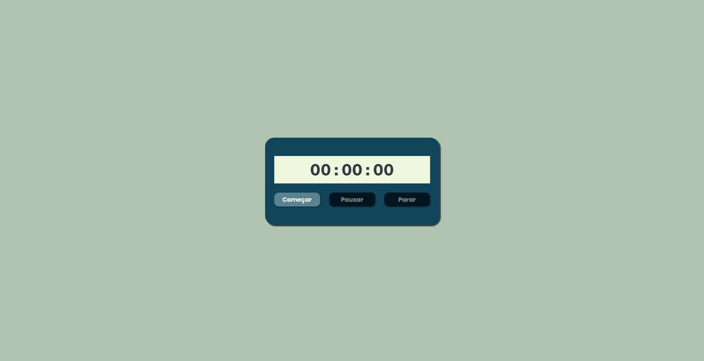

# **Cronômetro**

## :watch: **Projeto**
Este projeto se baseia em cronômetro ou temporizador.

   <a href="https://davsilvam.github.io/cronometro/">Veja o projeto completo aqui.</a>

## :art: **Visual do Projeto**
### *Desktop e Telas Maiores*

<h1 align="center">
    
</h1>

## :rocket: **Funcionalidades do Projeto**
O projeto conta atualmente com:
* Função *Começar* que iniciar o temporizador e retoma caso ele seja pausado;
* Função *Pausar* que pausa o temporizador;
* Função *Parar* que encerra a contagem e reinicia o temporizador.

## :wrench: **Tecnologias**
Tecnologias utilizadas no projeto.
* HTML;
* CSS;
* JavaScript;
* Visual Studio Code;
* Google Fonts.

## :balloon: **Inspiração**
*[Link para o vídeo de inspiração.](https://www.youtube.com/watch?v=QSW1374FCt4&t=1s)*

---
